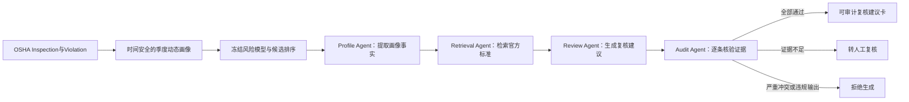

# RiskProfile-Agent项目：5名学生总体分工

> 论文方向：画像驱动的多Agent职业安全检查决策支持  

## RiskProfile-Agent简介

RiskProfile-Agent是一套面向职业安全检查的辅助分析系统。它先利用OSHA公开的历史检查和违章数据，为每个分析对象建立动态风险画像，再结合官方法规材料，生成有依据、可以核对的人工复核建议。

系统主要包括四个Agent：

- **Profile Agent（画像Agent）**：读取历史检查次数、历史违章情况和近期变化等画像信息，整理出需要说明的事实；
- **Retrieval Agent（检索Agent）**：从冻结的OSHA和eCFR官方知识库中查找相关法规依据；
- **Review Agent（复核建议Agent）**：结合画像与法规，生成不超过3项需要人工重点查看的内容；
- **Audit Agent（审计Agent）**：检查建议中的数字是否正确、引用是否可靠、是否出现无依据或超出研究范围的说法。

系统最后可以给出三种结果：证据充分时通过，信息不足时转交人工，存在严重问题时拒绝生成建议。它的目标是帮助工作人员更快地整理和核对信息，而不是代替检查人员作决定。

本论文重点研究：与普通LLM、普通RAG和单Agent方法相比，RiskProfile-Agent能否减少错误数字、错误引用和无依据内容，并提高生成结果的可追溯性与安全拒绝能力。

## 学生1：数据整理

大方向保持不变，继续负责OSHA公开数据的整理。

大概要做：

- 下载并整理Inspection和Violation数据；
- 完成数据清洗、表格连接、行业筛选和时间划分；
- 检查数据是否重复、缺失等；
- 把数据整理成匿名的动态画像和Agent输入。

## 学生2：文献、违章分类与法规资料

保留原来的文献阅读和违章分类方向，增加Agent需要使用的官方法规资料。

大概要做：

- 调研职业安全风险画像、RAG、多Agent和可信大模型相关论文；
- 整理每篇论文的数据、方法、结果和不足；
- 根据OSHA标准代码整理违章风险类别；
- 收集和整理OSHA、eCFR等官方法规材料；
- 帮助建立法规知识库。

## 学生3：动态画像、评价数据与作图

保留原来的画像设计和作图方向，增加Agent输入与评价样本建设。

大概要做：

- 设计历史检查次数、历史违章次数和近期变化等画像指标；
- 检查每个指标是否只使用当时已经知道的信息；
- 把动态画像整理成Profile Agent可以读取的格式；
- 建立一批用于评价Agent的标准样本和正确答案；
- 检查Agent生成内容中的画像数字是否准确；
- 制作研究框架、画像变化和Agent工作流程等论文图表。

## 学生4：Agent系统与模型实验

保留原来的模型实验方向，主要负责把各部分连接成完整的Agent系统并进行实验。

大概要做：

- 保留原来的静态画像与动态画像模型比较；
- 接入学生2准备的法规知识库和学生3准备的画像输入；
- 实现生成复核建议的Review Agent；
- 实现检查数字、引用和无依据内容的Audit Agent；
- 连接Profile、Retrieval、Review和Audit等模块；
- 比较固定模板、普通LLM、RAG、单Agent和多Agent等方法；
- 完成对比实验、消融实验、错误分析和正式Test。

## 学生5：人工评价，协助学生1-4

保留原来的论文整理和投稿方向，增加Agent输出的人工评价工作。

大概要做：

    -协助学生1-4的任务 
- 整理不同方法生成的匿名结果，组织人工盲评；
- 统计生成内容是否容易理解、证据是否充分、是否便于人工核对；
- 汇总五名同学的数据、方法、实验结果和图表；
- 检查论文中的数字、图表、引用和结论是否都有来源。

## 五人分工概括

| 学生 | 大方向 | 任务 |
|---|---|---|
| 学生1 | 数据整理 | 准备可信、匿名并且没有未来信息的数据 |
| 学生2 | 文献与法规 | 准备相关研究、风险分类和官方法规依据 |
| 学生3 | 画像与评价样本 | 准备Agent可读取的画像、标准答案和论文图表 |
| 学生4 | Agent与实验 | 完成多Agent系统并公平比较不同方法 |
| 学生5 | 评价与论文 | 组织人工评价并完成IEEE Access论文 |
